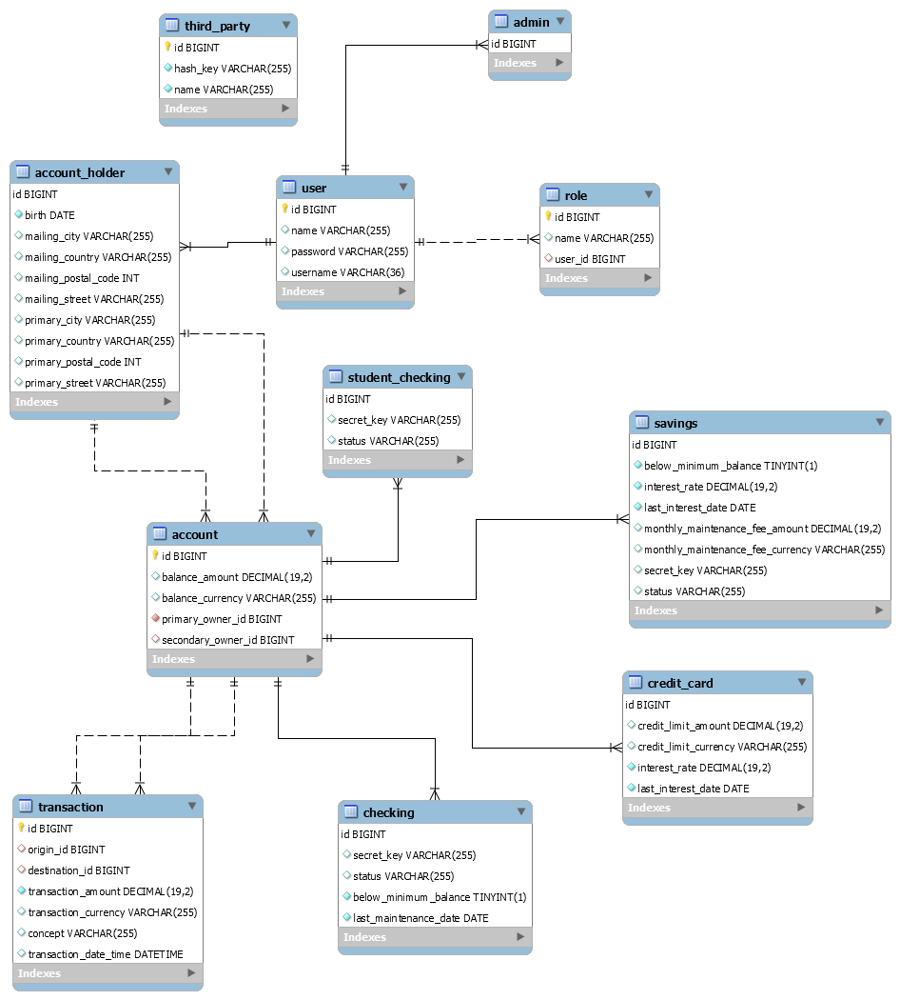

# Banking app

### Set-up

Rememeber to fill the username and password fields in the application.properties file. In this file, the TimeZone has been set to CET to properly register the time of the operations.

The database is in the route `./src/main/resources/banking.sql`, remember to build it before using the app. 

You can run lots of tests to try the program! :D

### Structure of the model

There are four type of accounts: Checking, StudentChecking, Savings and CreditCard. The all inherit from the abstract class Account. Every account has the following relationships:
* two One-to-Many with the Table transactions
* two Many-to-One with the owners

There are two types of users: AccountHolders and Admins, the two inherit from the User class. Only account holders can be account owners. They have two One-To-Many relationships with Account

Third Parties are considered an external user, so they do not have username, password nor roles.

### Functions

#### Admins

They can create:
* Account holders
* Other admin
* Third parties
* Any type of account

They can also check and modify any account's balance, and unfreeze accounts

#### Account holders
They can check the balance of any of their accounts
They can make transactions between accounts if they are the owners of the origin account

Finally, anyone with the credentials can deposit or withdraw money from an account (this would be a third-party transaction)

| Route | HTTP Method | Permissions | Controller file | Body | Request params |
|-------|-------|-------|-------|-------|-------|
| /new-account-holder | post | admin | AccountHolderController | AccountHolderDTO
| /new-admin | post | admin | AdminController | AdminDTO
| /new-checking | post | admin | CheckingController | CheckingDTO
| /new-credit-card | post | admin | CreditCardController | CreditCardDTO
| /new-savings | post | admin | SavingsController | SavingsDTO
| /new-third-party | post | admin | ThirdPartyController | ThirdPartyDTO
| /check-balance/{id} | get | admin, account_holder (owners) | AccountController |
| /modify-balance/{id} | patch | admin | AccountController | BalanceDTO |
| /transfer | post | account_holder (origin owners) | AccountController | TransactionDTO
| /withdraw/{hashedKey} | post | anyone | AccountController | TransactionDTO | secretKey
| /deposit/{hashedKey} | post | anyone | AccountController | TransactionDTO |secretKey
| /unfreeze/{id} | patch | admin | AccountController |

